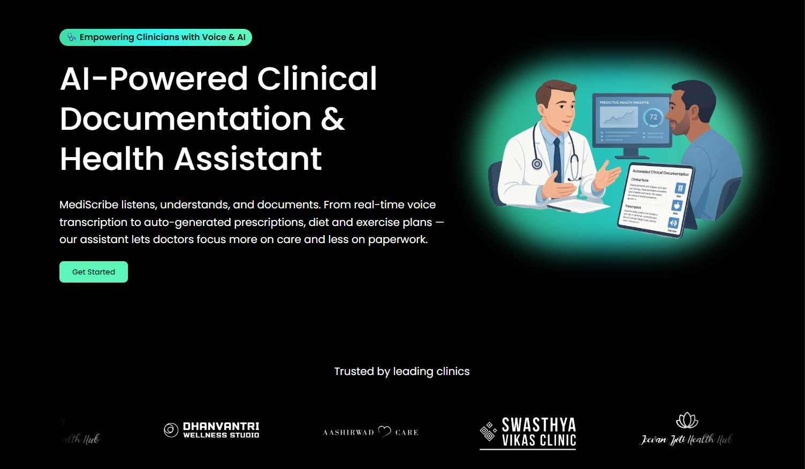
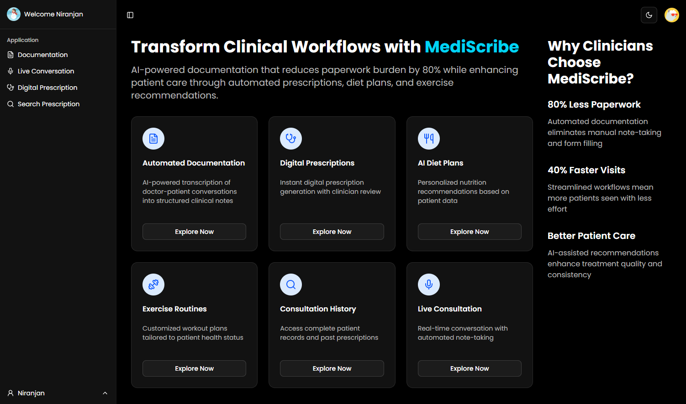
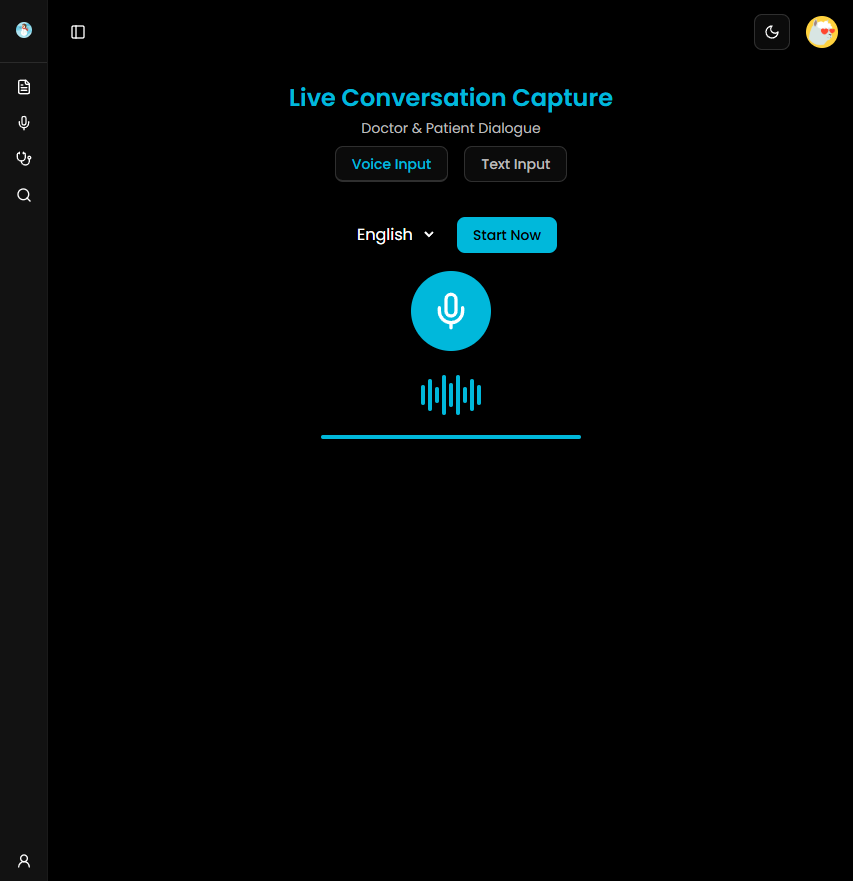
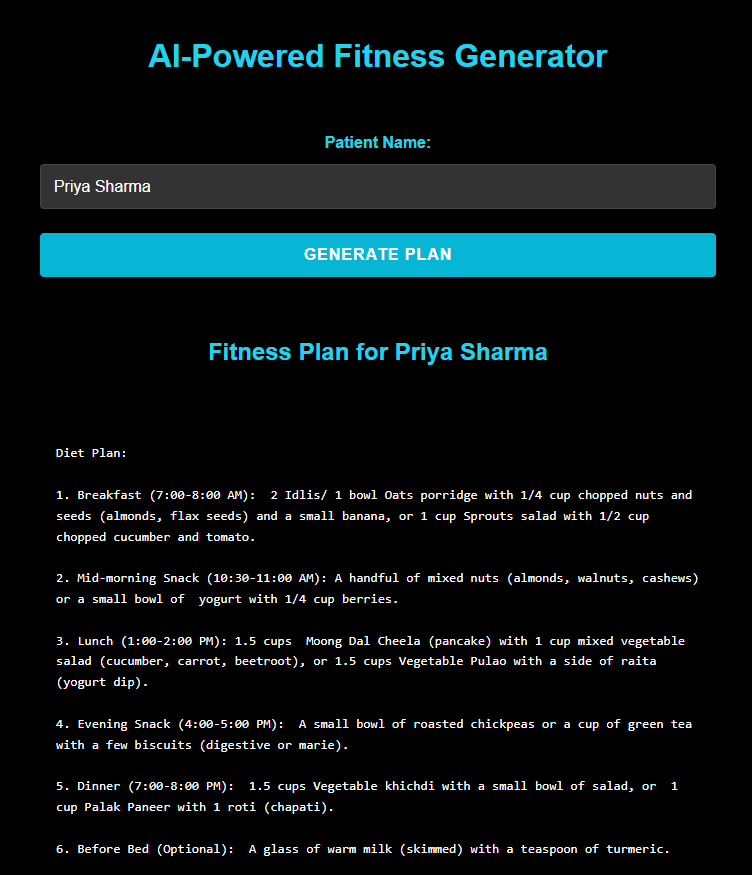

# Cyfuture AI Hackathon 1.0

*Team Name* – CODE4CHANGE  
*Team Members*:
- Debshata Choudhury  
- Niranjan Praveen  
- Abhishek Chaubhey  
- Vaibhav Jain  
- Pratham Ranjan  

*Problem Statement* – Automated Clinical Documentation: Use voice recognition and NLP to generate accurate clinical notes automatically.  
*Team Leader Email* – [debshatachoudhury@gmail.com](mailto:debshatachoudhury@gmail.com)

---

## Web App Title:

**MediScribe – AI-Powered Clinical Documentation & Assistant WebApp**

---

## A Brief of the Prototype:

*Interact with the UI of the website here* – [https://your-mediscribe-app.vercel.app/](https://your-mediscribe-app.vercel.app/)

MediScribe is a modular SaaS platform designed to **streamline clinical workflows** by automating doctor–patient interactions, generating structured notes, digital prescriptions, and personalized diet & exercise plans. Built with **Next.js** on the frontend and **Python (FastAPI/Flask)** in the backend, MediScribe leverages **Gemini API** for real-time transcription and NLP extraction, and integrates with **Stripe** for subscription management and **FHIR** for EMR interoperability.

  
  
  
  



---

## Key Features Include:

- **Voice Transcription & NLP** – Real-time doctor–patient conversation capture in two languages and structured note extraction via Gemini Speech-to-Text and NLP models.  
- **Digital Prescription Generator** – Create, edit, and download prescriptions with digital signature support.  
- **Diet & Exercise Recommendation Engine** – AI-driven, personalized health plans based on patient data.  
- **Clinician Review Interface** – Intuitive dashboard for review, editing, and approval of AI outputs.  
- **Subscription Management** – Stripe-powered tiered SaaS billing and access control.  
- **EMR Integration** – Optional FHIR API connectivity for seamless data exchange.  
- **Multi-User Roles**:
  - *Doctor* – Conduct consultations and finalize notes.  
  - *Assistant* – Manage audio uploads and preliminary reviews.  

---

## AI & Cloud Integration (Simplified Overview)

### Gemini Speech-to-Text Pipeline
- Capture live audio via WebRTC.  
- Stream to **Gemini Speech-to-Text API** for low-latency transcription.  

### Gemini API NLP Extraction
- Parse transcripts into **chief complaints**, **history**, **diagnosis**, and **treatment** sections.  
- Extract critical clinical entities using MedSpaCy.

## Technology Stack:

- **Frontend**: Next.js, Tailwind CSS, ShadCN UI, KindeAuth  
- **Backend**: FastAPI, Flask (Python), Qiskit (for future quantum-powered analytics)  
- **AI/ML**: Gemini API, Scikit-learn  
- **Database**: PostgreSQL (via Prisma/Supabase)  
- **Deployment**: Vercel (frontend), Render (backend)  

---

## Code Execution Instructions:

### 1. Clone the Repository  
```bash
git clone https://github.com/YourOrg/medi-scribe.git
cd medi-scribe
```

### 2. Install Frontend Dependencies  
```bash
cd client
npm install
```

### 3. Install Backend Dependencies  
```bash
cd ../server
pip install -r requirements.txt
```

### 4. Start Development Servers  

#### Frontend (Next.js)  
```bash
cd client
npm run dev
```

#### Backend (FastAPI/Flask)  
```bash
cd ../server
python app.py
```

### 5. Access the Application  
Open [http://localhost:3000](http://localhost:3000) in your browser.

---

## Scalability & Business Model:

- **Subscription Model**: Tiered pricing per clinic, with volume discounts.  
- **Enterprise Integrations**: EMR interoperability for hospitals and chains.  
- **Security & Compliance**: HIPAA/GDPR-ready encryption, role-based access controls.  
- **Modular Architecture**: Easy feature rollout (mobile app, multilingual, analytics).  
- **Affordability**: Pay-as-you-grow pricing, free basic tier for small practices.

---

## Summary

MediScribe transforms clinical documentation with an **AI-first approach**, combining real-time transcription, structured note extraction via **Gemini API**, and personalized health recommendations into a seamless SaaS platform—empowering clinicians to **reduce administrative overhead**, **improve patient engagement**, and **enhance care quality** in any healthcare setting.